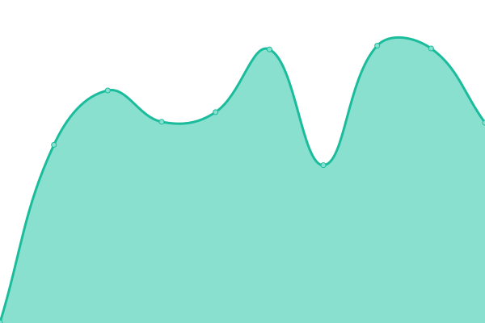
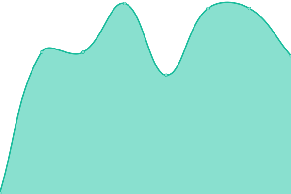

# [📈 Live Status](https://status.jomei.tk): <!--live status--> **🟩 All systems operational**

This repository contains the open-source uptime monitor and status page for [JoMei9019](dc.anturnia.net), powered by [Upptime](https://github.com/upptime/upptime).

With [Upptime](https://upptime.js.org), you can get your own unlimited and free uptime monitor and status page, powered entirely by a GitHub repository. We use [Issues](https://github.com/JoMei9019-real/upptime/issues) as incident reports, [Actions](https://github.com/JoMei9019-real/upptime/actions) as uptime monitors, and [Pages](https://status.jomei.tk) for the status page.

<!--start: status pages-->
<!-- This summary is generated by Upptime (https://github.com/upptime/upptime) -->
<!-- Do not edit this manually, your changes will be overwritten -->
<!-- prettier-ignore -->
| URL | Status | History | Response Time | Uptime |
| --- | ------ | ------- | ------------- | ------ |
|  [Anturnia](https://Anturnia.net) | 🟩 Up | [anturnia.yml](https://github.com/JoMei9019-real/upptime/commits/HEAD/history/anturnia.yml) | 

 500ms
     
 | 

<a href="https://status.jomei.tk/history/anturnia">100.00%</a>
    

|  [Wikipedia](https://en.wikipedia.org) | 🟩 Up | [wikipedia.yml](https://github.com/JoMei9019-real/upptime/commits/HEAD/history/wikipedia.yml) | 

 162ms
     
 | 

<a href="https://status.jomei.tk/history/wikipedia">100.00%</a>
    

|  [Status](https://status.jomei.tk) | 🟩 Up | [status.yml](https://github.com/JoMei9019-real/upptime/commits/HEAD/history/status.yml) | 

 349ms
     
 | 

<a href="https://status.jomei.tk/history/status">100.00%</a>
    

|  DNS | 🟩 Up | [dns.yml](https://github.com/JoMei9019-real/upptime/commits/HEAD/history/dns.yml) | 

 120ms
     
 | 

<a href="https://status.jomei.tk/history/dns">100.00%</a>
    

<!--end: status pages-->

[**Visit our status website →**](https://status.jomei.tk)

## 📄 License

- Powered by: [Upptime](https://github.com/upptime/upptime)
- Code: [MIT](./LICENSE) © [JoMei9019](dc.anturnia.net)
- Data in the `./history` directory: [Open Database License](https://opendatacommons.org/licenses/odbl/1-0/)
